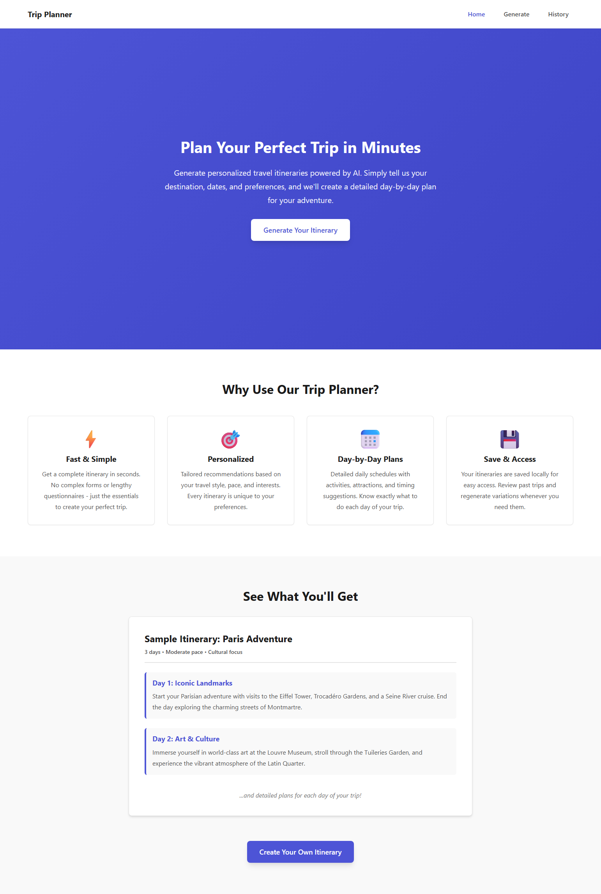
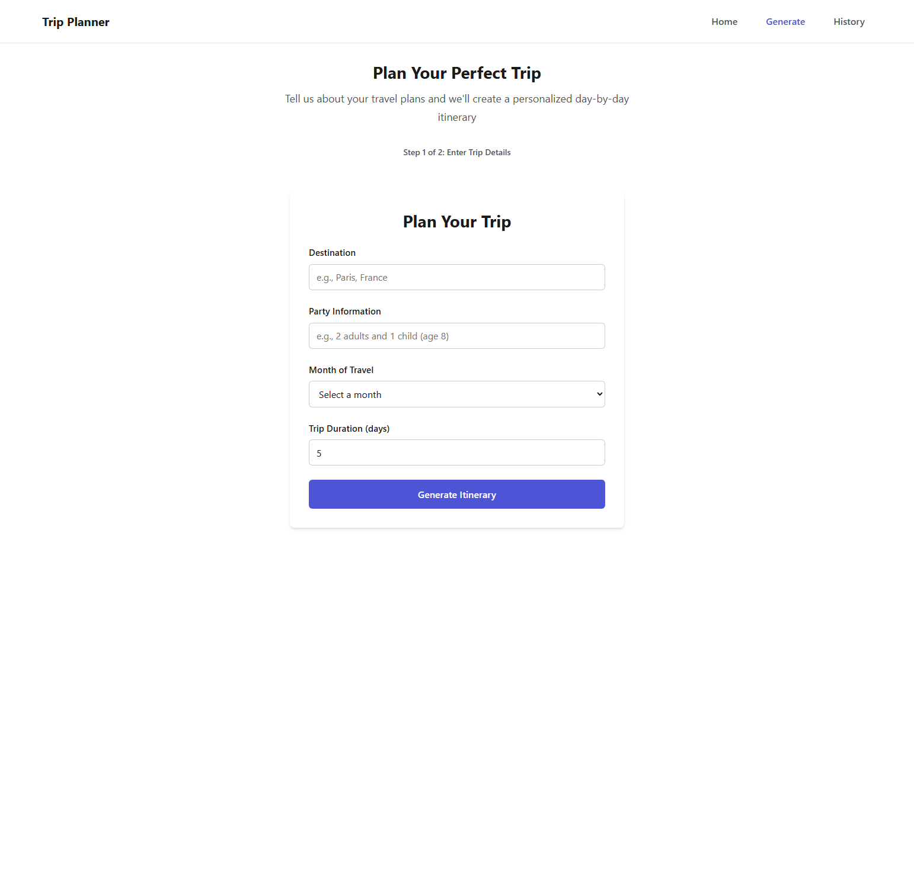
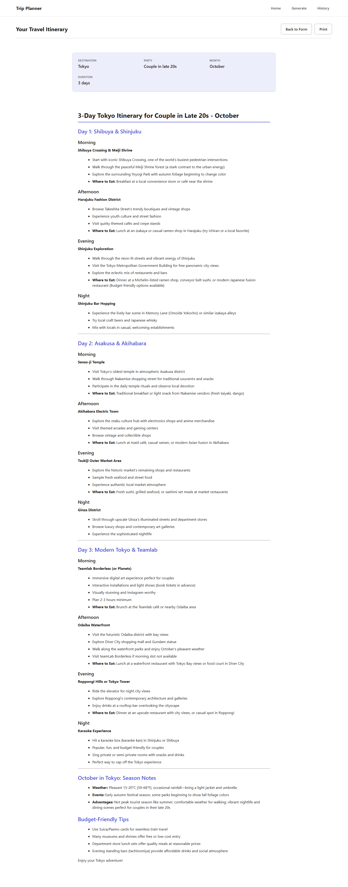
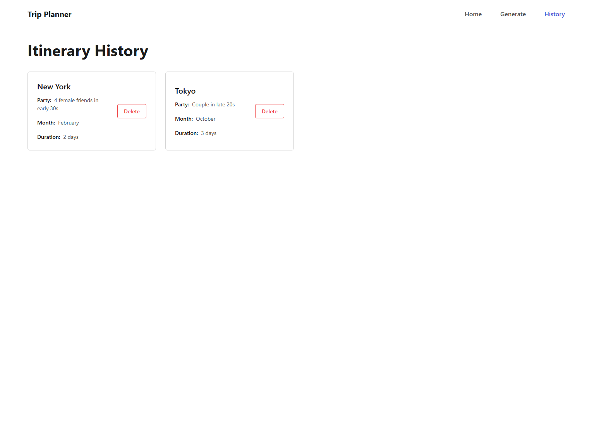

# Pantheon Dev Team - vibe-coding profile

## Overview
This is a demo project illustrating what it's like to use Pantheon Framework.

It builds a simple prototype LLM backed trip-planner app that:
* Creates a day-by-day travel itinerary based on the user submitted destination, party info, trip duration, and time of year.
* Shows a history of itinerary generated
* Uses headless Claude Code CLI command to simulate LLM API calls

To simulate real world development, there are 2 gotchas placed in the original project doc:
* It is not possible to run CLI command in browser context, but the project doc calls for it.
* The project doc calls for using JSON, but we switch the implemenation to be simpler using markdown response with markdown rendering in the frontend.

The above gotchas will showcase how the workflow handles unexpected situations and requirement changes.

## Caveat
Pantheon Framework's Glass Box Process allows for early interception of misalignment through auditable artifacts, resulting in earlier course correction. However, for the purpose of this demo, reviewing of the artifacts and early course correcting was deliberately not done. The goal of the demo is not to create the perfect app - but to show the auditable elements of created artifacts to highlight the early interception points. Due to this, the number of artifacts created and the implementation done is unoptimized for this demo, and may misrepresent the actual efficiency of the workflow.

## Team Description
This project uses the default `Pantheon Dev` team, using the `vibe-coding` profile.

```yaml
  vibe-coding:
    profile_description: Optimized for rapid vibe coding. Auto commits and
      leaves a progress log, with no other checks
    enforce_tdd: false
    run_and_fix_tests: false
    perform_code_review: false
    draft_commit_message: true
    auto_commit_each_phase: true
    enable_progress_log: true
    read_documentation: false
    update_documentation: false
    update_diagram: false
    lint_tools: []
```

The team:
* creates custom specialist agents for the project
* creates the initial architecture guide
* creates the initial backlog tickets
* creates a phased implementation plan for each ticket
* implements each phase of the implementation plan
* for each phase:
  * submits a progress log
  * drafts a commit message
  * auto commits after each phase

## What to look for
Taking a look at the following will give a good picture of what it's like to use the `Pantheon Dev` team with `vibe-coding` profile:

* **[Trip planner project doc](docs/trip-planner-original.md):** This is the original project doc given to @pantheon-dev to kick-off the project.

* **[Frontend-engineer](pantheon-artifacts/agents/[AD1]_frontend-engineer.md):** The specialist agent created for this project by @pantheon-dev

* **[LLM transcript](docs/transcript.txt):** This is the transcript between the user and the `Pantheon Dev` team throughout the building of the trip planner app. This will give you the full picture of what it's like to work with the Pantheon Dev team to build a project from scratch. Ignore how much time was spent by each agent in the transcript, as not all permission prompts were immediately handled, and the agents may have been stuck waiting for user response.

* **[Architecture guide](pantheon-artifacts/docs/architecture-guide/architecture-guide.md):** The arch guide created by @tech-lead during project kick-off. Note that this doc is modular monolithic doc and agents are not expected to read the entire doc at once, but rather get [specific sections defined](pantheon-teams/pantheon-dev/processes/get-architecture-guide/artifact/sections.jsonnet)

* **[System diagram](pantheon-artifacts/docs/system-architecture/system-components-diagram.puml):** The high-level system diagram created by @tech-lead during project kick-off. This is a PlantUML diagram and you may need to render it via plugins like the [jebbs PlantUML plugin](https://marketplace.visualstudio.com/items?itemName=jebbs.plantuml) on your IDE.

* **[Tickets](pantheon-artifacts/tickets/):** Tickets created and worked on for this project, including the initial description, implementation plan, progress logs, and commit messages.

* **[Trip planner README](trip-planner-README.md):** README created by `Pantheon Dev` team.

* **[Team Blueprint](pantheon-teams/pantheon-dev/blueprints/pantheon-dev-team_team-blueprint.md):** The original team blueprint for `Pantheon Dev` team.

* **[Processes](pantheon-teams/pantheon-dev/processes/):** Processes available for the `Pantheon Dev` team - the instruction, data schema, and template for each process and artifact. Each of these are completely editable and take effect immediately.

## Screenshots
Below are screenshots of the working protoype created by the `Pantheon Dev` team using the `vibe-coding` profile.

### Landing Page


### Itinerary Generation Page


### Tokyo Itinerary


### History Page
