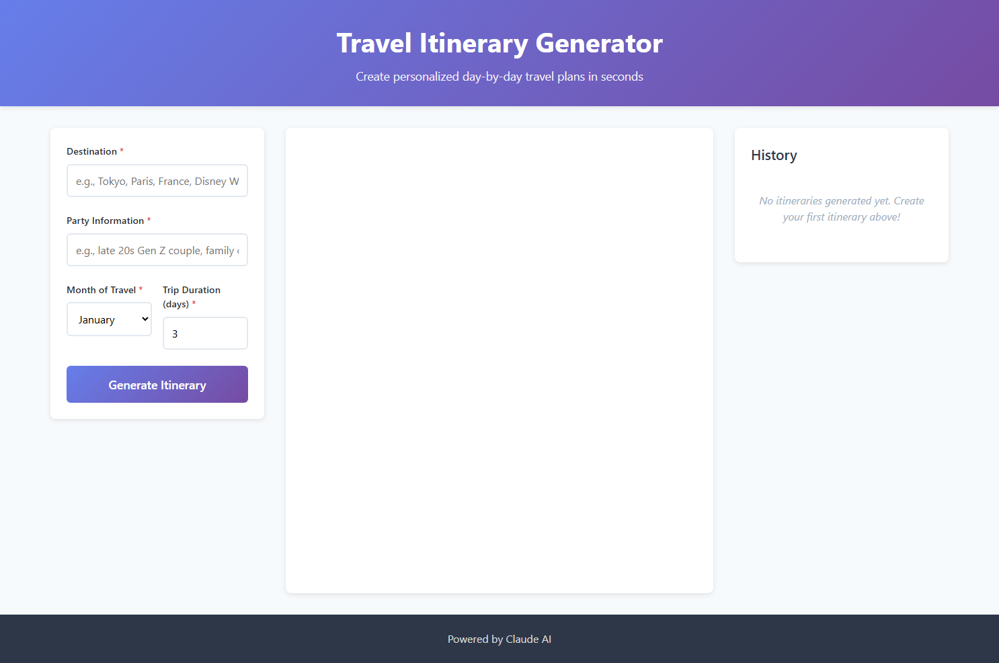
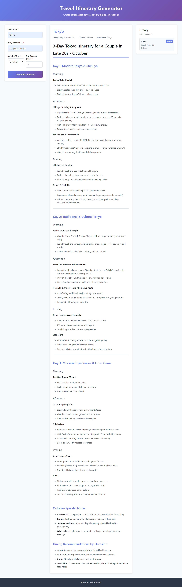

# Production Ready Team - A Custom Pantheon Framework Team 

## Overview
This is a demo project illustrating what it's like to use Pantheon Framework to create a custom team and use that custom team for development.

It builds a simple prototype LLM backed trip-planner app that:
* Creates a day-by-day travel itinerary based on the user submitted destination, party info, trip duration, and time of year.
* Shows a history of itinerary generated
* Uses headless Claude Code CLI command to simulate LLM API calls

To simulate real world development, there are 2 gotchas placed in the original project doc:
* It is not possible to run CLI command in browser context, but the project doc calls for it.
* The project doc calls for using JSON, but we switch the implemenation to be simpler using markdown response with markdown rendering in the frontend.

The above gotchas will showcase how the workflow handles unexpected situations and requirement changes.

## Caveat
Pantheon Framework's Glass Box Process allows for early interception of misalignment through auditable artifacts, resulting in earlier course correction. However, for the purpose of this demo, reviewing of the artifacts and early course correcting was deliberately not done. The goal of the demo is not to create the perfect app - but to show the auditable elements of created artifacts to highlight the early interception points. Due to this, the number of artifacts created and the implementation done is unoptimized for this demo, and may misrepresent the actual efficiency of the workflow.

## Team Description
This project uses a custom team built by `Pantheon Team Builder`. The [Production Ready workflow](https://www.reddit.com/r/ClaudeCode/comments/1mzvyyt/my_2_cents_of_making_claude_code_create/) shared on Reddit was used to build the team.

The team was created using the Reddit post directly. Note that `Pantheon Team Builder` is not meant to be a one-shot team creator. It is meant to have human-in-the-loop to refine the final team creation. But for the purpose of this demo, a one-shot approach was taken to test the capability of `Pantheon Team Builder`, following the standard process outlined in the Team Blueprint comments, without further review or changes.

The team was created with the following flow:
```
@pantheon-team-builder create a team blueprint based on @docs/production-ready-workflow.md

@artifact-designer, design the artifacts for TB01 and update the team blueprint. Do not build the artifacts yet, focus on updating the team blueprint with the artifact design.

@agent-designer, design the agents for TB01 and update the team blueprint. Do not build the agents yet, focus on updating the team blueprint with the agent design.

@team-readme-writer, create the team readme based on @[TB01]_production-ready-development-team_team-blueprint.md

@profile-designer, design the team profile for the blueprint TB01

@profile-designer create the team profile from @[TB01]_production-ready-development-team_team-blueprint.md

@agent-designer create the agents from @[TB01]_production-ready-development-team_team-blueprint.md

@artifact-designer, build the artifacts from @[TB01]_production-ready-development-team_team-blueprint.md
```

The created custom `Production Ready` team:
* creates an issue specific PRD as the single source of truth for implementation
* creates an implementation evaluation report, evaluating the implementation against the original PRD

## What to look for
Taking a look at the following will give a good picture of what it's like to use the `Pantheon Team Builder` to create a custom team and what it's like to use that custom `Production Ready` team to do real development:

**Pantheon Team Builder**
* **[Production Ready workflow](docs/production-ready-workflow.md):** The post content describing the Production Ready workflow as shared on [Reddit](https://www.reddit.com/r/ClaudeCode/comments/1mzvyyt/my_2_cents_of_making_claude_code_create/).
* **[Production ready team blueprint](pantheon-artifacts/pantheon-team-builds/production-ready-development/blueprints/[TB01]_production-ready-development-team_team-blueprint.md):** The Team Blueprint capturing the design of the Production Ready team (the final team name ended up being production-ready-development team).
* **[Production ready team README](pantheon-artifacts/pantheon-team-builds/production-ready-development/team-readme/[TR1]_production-ready-development-team_team-readme.md):** The team README created for the Production ready team. This README was later used as a reference to develop the trip planner with the Production ready team.
* **[Production ready team agents](pantheon-artifacts/pantheon-team-builds/production-ready-development/agents/):** Agents created for the Production ready team.
* **[Production ready team processes](pantheon-artifacts/pantheon-team-builds/production-ready-development/processes/):** Processes created for the Production ready team.

**Production Ready Team**
* **[Trip planner project doc](docs/trip-planner.md):** This is the original project doc given to @brainstorm-facilitator to create the initial feature-brainstorm doc.

* **[LLM transcript](docs/transcript.txt):** This is the transcript between the user and the `Production ready` team throughout the building of the trip planner app. This will give you the full picture of what it's like to work with the `Production ready` team to build a project from scratch. Ignore how much time was spent by each agent in the transcript, as not all permission prompts were immediately handled, and the agents may have been stuck waiting for user response. Note that this transcript missed capturing the changes from JSON schema to Markdown, and some debugging related to running CLI commands on Windows.

* **[Issue specific PRD](pantheon-artifacts/issue-specific-prd/[ISP1]_TRIP-001_issue-specific-prd.md):** The issue specific PRD created based on the [trip planner project doc](docs/trip-planner.md).

* **[Implementation evaluation report](pantheon-artifacts/implementation-evaluation-report/[IER1]_ISP1_evaluation-report.md):** Implementation evaluation report based on the implementation and the [Issue specific PRD](pantheon-artifacts/issue-specific-prd/[ISP1]_TRIP-001_issue-specific-prd.md)

* **[Trip planner README](trip-planner/README.md):** Project README doc created by the `Production ready` team.

* **[Processes](pantheon-teams/production-ready-development/processes/):** Processes available for the `Production ready` team - the instruction, data schema, and template for each process and artifact. Each of these are completely editable and take effect immediately.

## Screenshots
Below are screenshots of the working protoype created by the `Production ready` team.

### Itinerary Generation Page


### Tokyo Itinerary with History Sidebar

